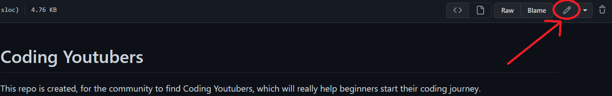

# Contribution

## Link qualification
Links have to contain YouTube content pertaining to coding. It has to be helpful, contain a short description as to why it's helpful.
Here are some rules to follow when adding a link to make sure it qualifies:
1. Before proceeding with every step below, take your time to read the current list to see if the Youtuber you want to add hasn't already been added. (This saves the maintainer's time when reviewing your pull request.
2. The link has to be a **YouTube** link.
3. Based on the point above, no links to the Youtuber's other accounts such as Twitter, Github, etc.
4. The content within the Youtube channel must be about code or coding.
5. Ensure that the content is objective and not opiniated. This means no resources that talks about someone's thoughts of a topic, even if you personally find it helpful.
6. If you're a YouTuber making beginner-styled tutorial content on, you're allowed to post a link to your channel given it follows the other rules detailed above.
## Adding a link
Adding a YouTuber is straightforward!
1. Get the YouTuber's channel link you want to add.
2. Go to the [README](https://github.com/collab-community/coding-youtubers/blob/main/README.md)
3. Click on the edit icon on the top right

4. Scroll to the bottom of the table and input your Youtube channel link with the format in mind.
Format:
```
| [YouTube Channel Name](YouTube Channel Link) | Description | Language|
```
Example:
```
| [FreeCodeCamp.org](https://www.youtube.com/Freecodecamp) | Covers various fields/concepts of programming | English |
```
5. Once you're done, scroll to the bottom to commit the change. Make sure that the title of the commit is relevant.
6. After adding the commit title, click on propose changes and follow the steps to create a pull request.

*If you followed the steps above correctly, congratulations on making your contribution!*
